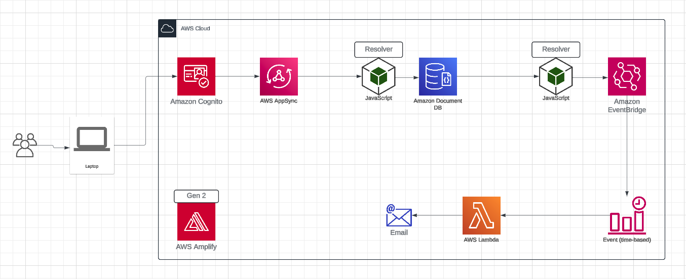

# Easy Scheduler

## Purpose:

Easy Scheduler is a personal project designed to provide an efficient solution for scheduling messages and reminders, ensuring users can manage their tasks conveniently. This system leverages AWS services to handle backend operations, making it scalable and reliable. The primary AWS services utilized include Lambda for serverless compute, EventBridge for event-driven architecture, and DynamoDB for fast and flexible NoSQL database services.

## Tech Stacks

### Fronend

- React: A JavaScript library for building user interfaces, providing a component-based structure.
- Material UI: A popular React UI framework that implements Google's Material Design.
- Formik: A library for building forms in React, managing form state, validation, and submission.
- Vite: A fast build tool and development server for modern web projects, offering an optimized build process.

### Backend

The backend architecture is designed to handle authentication, data management, and event scheduling seamlessly using AWS services.

## Backend Architecture Diagram

The architecture diagram below illustrates the integration of various AWS services and the data flow within the Easy Scheduler application.



## To run project.

To set up and run the project locally, follow these steps:

1. **Install dependencies**:

   ```bash
   yarn install
   ```

2. **Start the development**:

   ```bash
   yarn dev
   ```

3. **For the backend**:
   ```bash
   npx ampx sandbox --profile <YOUR PROFILE>
   ```

### Deployment

The application can be deployed directly from the AWS Amplify Console by linking to the GitHub project repository. This integration allows for continuous deployment and easy management of the application lifecycle.

## Conclusion

Utilizing the new Amplify Gen 2, we can seamlessly build and integrate both backend and frontend components of our application. This approach offers several significant advantages, including the ability to provide each developer with a dedicated sandbox environment for deployment and the capability to manage infrastructure as code using tools like the AWS Cloud Development Kit (CDK).
